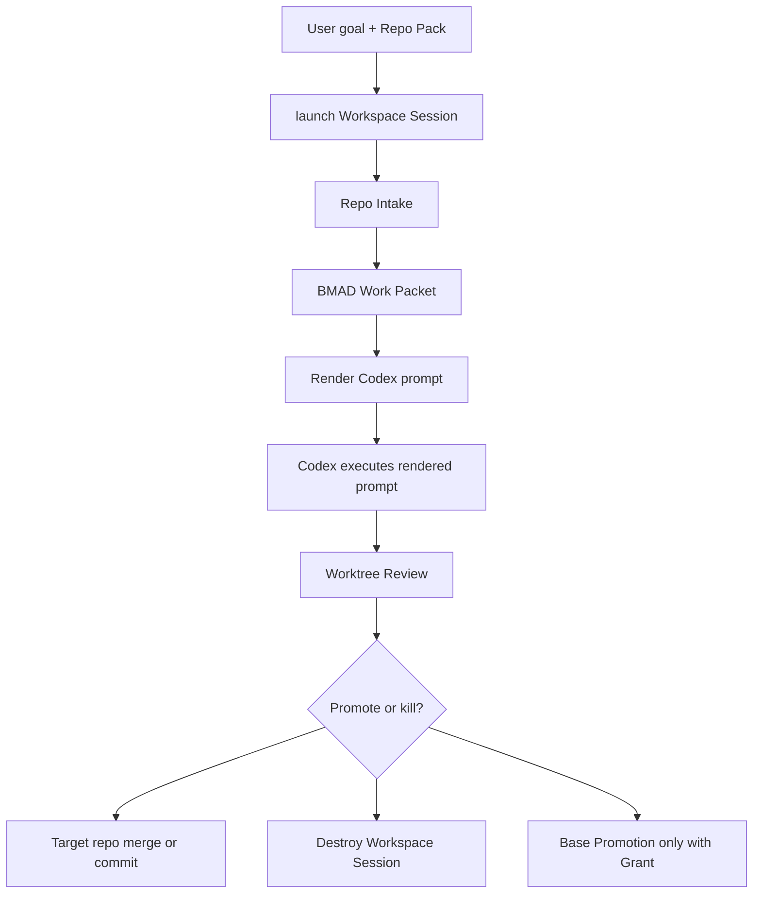

# BMAD Workspace Architecture

## Architecture Thesis

BMAD is the kernel. Everything durable is justified by BMAD artifacts, gates, and
review. Codex executes. Adapter providers supply capabilities behind BMAD-owned
interfaces. The V4 system is a CLI and filesystem contract backed by Git
worktrees.

## Zoom-Out Map

```text
BMAD Workspace
  -> launches Workspace Session
  -> provides BMAD Kernel, policies, adapters, templates, secret refs

Workspace Session
  -> attaches Repo Pack as Git worktrees
  -> runs Repo Intake
  -> asks BMAD Router for workflow
  -> produces BMAD Work Packet
  -> renders prompt for Codex Executor
  -> receives work in Target Repos
  -> emits Worktree Review
  -> is destroyed or retained for review
```

## Module Map

| Module | Interface | Responsibility |
| --- | --- | --- |
| BMAD Workspace | `launch`, `policy`, `capabilities` | Own durable BMAD base, policies, adapters, templates, and secret references. |
| Workspace Session | `instance.json`, `destroy` | Hold disposable runtime, grants, Repo Pack links, logs, and review artifacts. |
| Repo Intake | `intake` | Produce code evidence and provenance before BMAD Work Packet creation. |
| BMAD Router | `route` | Select BMAD workflow path and required artifacts. |
| BMAD Work Packet | `packet` | Own session goal, evidence, constraints, acceptance criteria, grants, and rendered prompt. |
| Capability Contract | `capabilities.json` | Expose BMAD-governed adapter capabilities to executors. |
| Codex Executor Adapter | `run` | Execute rendered prompt under grants and BMAD constraints. |
| Worktree Review | `review` | Produce per-repo status, patches, changed files, and notes. |
| Grant Guard | `authorize` | Enforce path, repo, capability, persistence, and base-write rules. |

## Storage Boundaries

| Boundary | Example Artifacts | Persistence Rule |
| --- | --- | --- |
| BMAD Workspace | BMAD skills, policies, templates, adapter registry, standing orders | Durable; changed only by Base Improvement Session with grant. |
| Workspace Session | `instance.json`, intake output, packets, logs, review output | Disposable; retained only by explicit review policy. |
| Target Repo Worktree | Source changes, tests, commits, patches | Durable in target repo workflow, not in base. |
| Secret Store | Token references, credential handles | External; values never copied into artifacts. |

## Filesystem Sketch

```text
workspace/
  bmad/
    policies/
    templates/
    standing-orders/
  adapters/
    capability-contract.json
  sessions/
    <session-id>/
    instance.json
    grants.json
    repo-pack.json
    intake/
      repo-intake.json
      provenance.json
    packets/
      bmad-work-packet.json
      rendered-prompt.md
    review/
      status.json
      diff.patch
      promotion-notes.md
    worktrees/
      <repo-name>/
```

## Interface Sketch

```bash
workspace launch --repo <path> --goal <file> --grant <grant.json>
workspace intake <session-id>
workspace packet <session-id> --zoom-out-ref <ref> --ubiquitous-language-ref <ref> --grill-decisions-ref <ref> --tdd-plan-ref <ref>
workspace review <session-id>
workspace destroy <session-id> [--keep-review]
```

`launch` creates the Workspace Session, attaches repo worktrees, records grants,
and writes `instance.json`.

`intake` runs Graph Evidence Adapter or equivalent scoped scan and writes
provenance tied to repo HEAD.

`packet` asks BMAD Router for the workflow and writes the BMAD Work Packet.
It fails if intake is missing or stale.

`review` emits per-repo Git status, patch, changed files, and Promotion notes.

`destroy` removes runtime state while preserving target repo state and any review
artifacts retained by policy.

## BMAD Work Packet Shape

```json
{
  "kind": "bmad-work-packet",
  "packetVersion": 4,
  "sessionId": "session-2026-05-04-example",
  "bmadWorkflow": "bmad-quick-dev",
  "goal": "Fix the reported bug",
  "repoIntakeRefs": ["intake/repo-intake.json"],
  "constraints": ["Do not mutate BMAD Workspace"],
  "grants": ["grants.json"],
  "acceptanceCriteria": ["Tests pass", "Worktree Review ready"],
  "capabilityContractRef": "capabilities.json",
  "renderedPromptRef": "packets/rendered-prompt.md",
  "sessionSetup": {
    "zoomOut": { "status": "complete", "ref": "docs/workspace/v4-zoom-out.md" },
    "ubiquitousLanguage": { "status": "complete", "ref": "UBIQUITOUS_LANGUAGE.md" },
    "grillDecisions": { "status": "skipped", "skipReason": "Decision already captured." },
    "tddPlan": { "status": "complete", "ref": "docs/workspace/v4-backlog.md#tdd-order" }
  },
  "reviewPlan": "Run BMAD Code Review after execution"
}
```

## Repo Intake Shape

```json
{
  "repo": "example",
  "path": "/absolute/path/or/worktree",
  "head": "40-character-git-sha",
  "scanner": "graphify",
  "scannedAt": "2026-05-04T00:00:00Z",
  "scope": ["src", "tests"],
  "summary": {
    "modules": [],
    "constraints": [],
    "risks": [],
    "relevantFiles": []
  },
  "graphRef": "intake/graph.json"
}
```

## Adapter Policy

- Graphify is a Graph Evidence Adapter, not the memory brain.
- OpenClaw and Hermes are Runtime Adapters for sessions, tasks, Cron, Heartbeat,
  and goals when a BMAD-approved workflow needs those capabilities.
- Context7 is a Documentation Evidence Adapter for trusted current docs.
- Git is the provenance, rollback, and Worktree Review Adapter.
- MCP and GitHub are capability surfaces behind the Capability Contract.
- Any adapter that duplicates scheduler, planner, memory, review, grant, or
  base improvement behavior must provide upstream-gap proof.

## Grant Guard

Grant Guard evaluates every durable action against:

- allowed repos
- allowed paths
- allowed capabilities
- allowed persistence
- base mutation rights
- secret access references
- expiration or session boundary

Normal sessions have `baseMutation=false`. Base Improvement Sessions require
`baseMutation=true` and explicit granted paths.

## Sequence



## V4 Boundary

V4 proves the contract with CLI, files, Git worktrees, deterministic Setup Gate
checks, and vendored setup skill snapshots. Live schedulers, background workers,
custom UIs, and autonomous execution are later decisions only after BMAD
artifacts justify them.
