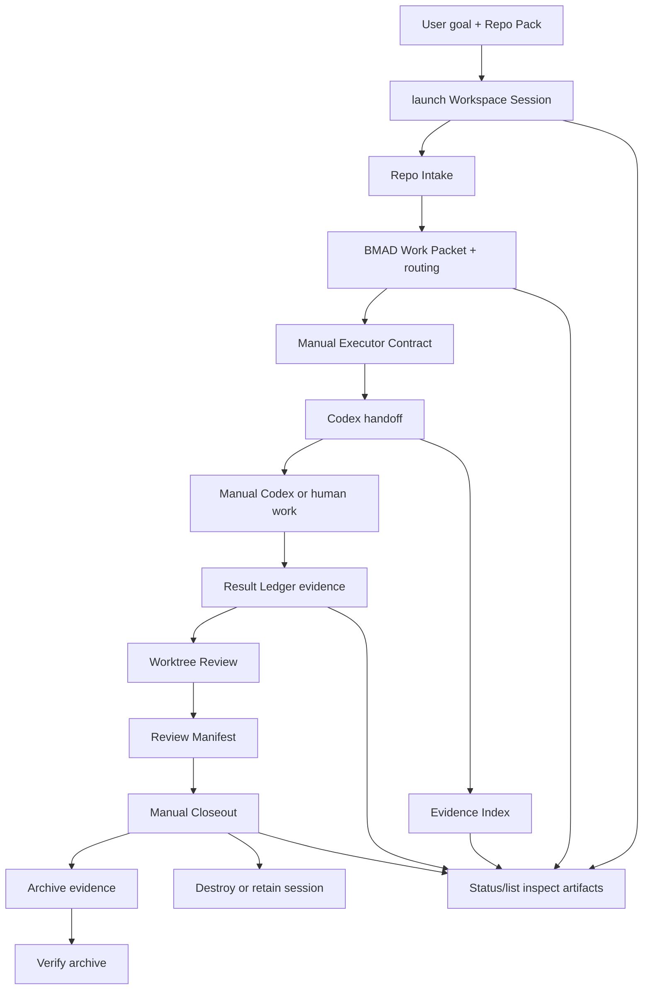

# BMAD Workspace Architecture

## Architecture Thesis

BMAD is the kernel. Everything durable is justified by BMAD artifacts, gates,
manual evidence, and review. Codex executes outside the Workspace CLI. Adapter
providers supply capabilities behind BMAD-owned interfaces. The current system is a
manual Workspace Session CLI and filesystem contract backed by Git worktrees,
release-readiness checks, typed Review Manifest evidence, read-only Evidence
Index inspection, declared Capability Verification, archive diff inspection, and
evidence-only artifacts.

## Zoom-Out Map

```text
BMAD Workspace
  -> launches Workspace Session
  -> provides BMAD Kernel, policies, adapters, templates, secret refs

Workspace Session
  -> attaches Repo Pack as Git worktrees
  -> records Repo Intake
  -> creates BMAD Work Packet with Setup Gate and routing
  -> writes Manual Executor Contract
  -> renders prompt for Codex Executor
  -> accepts manual Result Ledger evidence
  -> emits Worktree Review
  -> writes typed Review Manifest evidence
  -> accepts Manual Closeout evidence
  -> emits read-only Evidence Index for operator trust
  -> verifies declared capability requests without runtime probing
  -> compares archives with read-only Workspace Diff
  -> can be archived, verified, destroyed, or retained for review
```

## Module Map

| Module | Interface | Responsibility |
| --- | --- | --- |
| BMAD Workspace | `policy`, `capabilities`, templates | Own durable BMAD base, policies, adapter contracts, templates, and secret references. |
| Workspace Session | `launch`, `instance.json`, `destroy` | Hold disposable runtime, grants, Repo Pack links, and reviewable artifacts. |
| Repo Intake | `intake` | Record target repo provenance before BMAD Work Packet creation. |
| BMAD Router | `packet --workflow` | Select or validate the next manual BMAD workflow route. |
| BMAD Work Packet | `packets/bmad-work-packet.json` | Own goal, evidence, constraints, acceptance criteria, setup gate, routing, grants, and prompt refs. |
| Manual Executor Contract | `packets/executor-contract.json` | Declare allowed write roots and manual execution steps for Codex or a human operator. |
| Result Ledger | `result` | Record manual execution evidence as inert JSON data. |
| Worktree Review | `review` | Produce per-repo status, patches, changed files, and review summary. |
| Review Manifest | `review/review-manifest.json` | Record typed checks, findings, source refs, and review capability boundaries. |
| Manual Closeout | `closeout` | Record final manual session decision and next manual review path. |
| Evidence Index | `evidence` | Report artifacts, checksums, validation state, and next manual actions without writes. |
| Capability Verifier | `verify-capability` | Check one Capability Request JSON against declared capabilities without runtime discovery. |
| Workspace Diff | `diff` | Compare verified archive evidence bundles without writes. |
| Archive | `archive`, `verify-archive` | Preserve and verify portable evidence bundles without restore or replay. |
| Status and Handoff | `status`, `list`, `handoff` | Inspect session state and emit continuation context without writes. |
| Grant Guard | `authorize` | Enforce path, repo, capability, persistence, and base-write rules. |

## Storage Boundaries

| Boundary | Example Artifacts | Persistence Rule |
| --- | --- | --- |
| BMAD Workspace | BMAD skills, policies, templates, adapter registry, standing orders | Durable; changed only by Base Improvement Session with grant. |
| Workspace Session | `instance.json`, intake, packets, results, review, closeout, archives | Disposable; retained only by explicit review or archive policy. |
| Target Repo Worktree | Source changes, tests, commits, patches | Durable in target repo workflow, not in base. |
| Secret Store | Token references, credential handles | External; values never copied into artifacts. |

## Filesystem Sketch

```text
workspace/
  bmad/
    policies/
    templates/
    standing-orders/
  adapters/
    capability-contract.json
  sessions/
    <session-id>/
    instance.json
    grants.json
    repo-pack.json
    intake/
      repo-intake.json
      provenance.json
    packets/
      bmad-work-packet.json
      rendered-prompt.md
      executor-contract.json
    results/
      <result-id>.json
    review/
      summary.json
      review-manifest.json
      status.json
      diff.patch
    closeout/
      <closeout-id>.json
    worktrees/
      <repo-name>/
```

## Interface Sketch

```bash
bmad workspace launch --repo <path> --goal <file> --runtime-root <root>
bmad workspace intake <session-id> --runtime-root <root>
bmad workspace packet <session-id> --runtime-root <root> --workflow <skill[:action]> --zoom-out-ref <ref> --ubiquitous-language-ref <ref> --grill-decisions-ref <ref> --tdd-plan-ref <ref>
bmad workspace status <session-id> --runtime-root <root>
bmad workspace list --runtime-root <root>
bmad workspace handoff <session-id> --runtime-root <root>
bmad workspace evidence <session-id> --runtime-root <root>
bmad workspace verify-capability --input <request-json>
bmad workspace diff --left <archive-dir> --right <archive-dir>
bmad workspace result <session-id> --runtime-root <root> --input <result-json> --result-id <id>
bmad workspace review <session-id> --runtime-root <root>
bmad workspace closeout <session-id> --runtime-root <root> --input <closeout-json> --closeout-id <id>
bmad workspace archive <session-id> --runtime-root <root> --output <archive-dir>
bmad workspace verify-archive <archive-dir>
bmad workspace destroy <session-id> --runtime-root <root> [--keep-review]
bmad workspace authorize <session-id> --runtime-root <root> --write-path <path>
```

`launch` creates the Workspace Session, attaches repo worktrees, records grants,
and writes `instance.json`.

`intake` records code-only provenance tied to repo HEAD.

`packet` asks BMAD Router for the workflow and writes the BMAD Work Packet.
It fails if intake is missing or stale, setup evidence is incomplete, or an
explicit workflow route is unknown.

`status` and `list` inspect stored artifacts only. They report blockers and a
derived lifecycle state without persisting workflow authority.

`handoff` emits copy-ready continuation context. It is Markdown, not JSON.

`evidence` emits a read-only Evidence Index. It reports artifact presence,
checksums, validation state, and next manual actions. It does not write session
artifacts.

`verify-capability` checks one self-contained Capability Request JSON against
declared Workspace Capability Contract entries. It performs exact, case-sensitive
capability id matching and existing contract constraint checks only. It does not
infer aliases, inspect `_bmad/custom`, read local Codex config, run Graphify,
call app-server APIs, authorize writes, or replace Evidence Gate, Grant Guard,
self-improve, install, or quality checks.

`diff` verifies two archive evidence bundles and emits JSON deltas. It is
archive-only and does not read live Session paths.

`result` records manual execution evidence. It never executes command strings.

`review` emits per-repo Git status, patch, changed files, review summary, and
typed Review Manifest evidence.

`closeout` records a final manual decision. It never archives, destroys, merges,
promotes, restores, replays, schedules, watches, or activates adapters.

`archive` writes a portable evidence bundle. `verify-archive` checks that bundle
without reading live Session paths.

`destroy` removes runtime state while preserving target repo state and any review
artifacts retained by policy.

`authorize` validates durable writes against grants. It does not perform writes.

## BMAD Work Packet Shape

```json
{
  "kind": "bmad-work-packet",
  "packetVersion": 5,
  "sessionId": "session-2026-05-04-example",
  "bmadWorkflow": "bmad-quick-dev",
  "goal": "Fix the reported bug",
  "evidenceGates": [
    {
      "id": "repo-intake-graph",
      "requiredCapabilityIds": ["evidence.graph.repo-intake"],
      "required": true,
      "evidenceRefIds": ["repo-intake-graph-evidence"],
      "freshnessPolicy": "mtime",
      "message": "Workspace packet requires fresh repo-intake graph evidence from checked-in graph artifacts."
    }
  ],
  "evidenceRefs": [
    {
      "id": "repo-intake-graph-evidence",
      "capability": "evidence.graph.repo-intake",
      "artifactRef": "intake/graph.json",
      "sha256": "<sha256>",
      "generatedAt": "2026-05-04T00:00:00.000Z",
      "sourceFiles": [{ "path": "intake/repo-intake.json", "sha256": "<sha256>" }]
    }
  ],
  "constraints": ["Do not mutate BMAD Workspace"],
  "grants": ["grants.json"],
  "acceptanceCriteria": ["Tests pass", "Worktree Review ready"],
  "capabilityContractRef": "capabilities.json",
  "renderedPromptRef": "packets/rendered-prompt.md",
  "executorContractRef": "packets/executor-contract.json",
  "routing": {
    "routingSchemaVersion": 1,
    "selectedWorkflow": "bmad-quick-dev",
    "source": "deterministic"
  },
  "sessionSetup": {
    "zoomOut": { "status": "complete", "ref": "external:zoom-out-map" },
    "ubiquitousLanguage": { "status": "complete", "ref": "UBIQUITOUS_LANGUAGE.md" },
    "grillDecisions": { "status": "skipped", "skipReason": "Decision already captured." },
    "tddPlan": { "status": "complete", "ref": "external:tdd-plan" }
  },
  "reviewPlan": "Run BMAD Code Review after execution"
}
```

## Repo Intake Shape

```json
{
  "repo": "example",
  "path": "/absolute/path/or/worktree",
  "head": "40-character-git-sha",
  "scanner": "graphify",
  "scannedAt": "2026-05-04T00:00:00Z",
  "scope": ["src", "tests"],
  "summary": {
    "modules": [],
    "constraints": [],
    "risks": [],
    "relevantFiles": []
  },
  "graphRef": "intake/graph.json"
}
```

## Adapter Policy

- Graphify is a Graph Evidence Adapter, not the memory brain.
- OpenClaw and Hermes are Runtime Adapters for sessions, tasks, Cron, Heartbeat,
  and goals when a BMAD-approved workflow needs those capabilities.
- Context7 is a Documentation Evidence Adapter for trusted current docs.
- Git is the provenance, rollback, and Worktree Review Adapter.
- MCP and GitHub are capability surfaces behind the Capability Contract.
- Any adapter that duplicates scheduler, planner, memory, review, grant, or
  base improvement behavior must provide upstream-gap proof.

## Grant Guard

Grant Guard evaluates every durable action against:

- allowed repos
- allowed paths
- allowed capabilities
- allowed persistence
- base mutation rights
- secret access references
- expiration or session boundary

Normal sessions have `baseMutation=false`. Base Improvement Sessions require
`baseMutation=true` and explicit granted paths.

## Derived Lifecycle

Lifecycle is derived from stored artifacts only. It is not a durable workflow
engine and does not authorize work.

| Derived State | Evidence |
| --- | --- |
| `launched` | `instance.json` exists and validates. |
| `intake-recorded` | Repo Intake exists and is fresh. |
| `packet-ready` | BMAD Work Packet and rendered prompt validate. |
| `executor-ready` | Executor Contract validates. |
| `result-recorded` | One or more valid Result Ledger artifacts exist. |
| `review-recorded` | Worktree Review summary exists and validates. |
| `closeout-recorded` | One or more valid closeout artifacts exist. |
| `blocked` | Any high-severity status check or invalid artifact exists. |

## Evidence Index

Evidence Index is a derived view over stored artifacts. It records:

- `state: complete | warning | invalid`
- artifact `stage`, `kind`, `ref`, `present`, `validationState`, `sha256`,
  `bytes`, and `sourceCommand`
- check `code`, `severity`, `message`, `ref`, and `nextManualAction`

The index is not a durable authority, execution plan, restore input, replay
input, approval, scheduler input, or adapter instruction.

## Review Manifest

Review Manifest is a typed evidence map written by `bmad workspace review`.
It records:

- `kind: bmad-workspace-review-manifest` and `schemaVersion: 1`
- source refs for Work Packet, Executor Contract, Capability Contract, Result
  Ledger, Worktree Review summary, Closeout, archive, and archive diff when
  present
- allowed review artifact capabilities
- forbidden actions including execution, restore, replay, merge, promotion,
  scheduling, watching, fetching, live adapter activation, and hidden subprocess
- checks, findings, and a manual decision state

Review Manifest is not approval, scoring, promotion, merge authority, scheduler
input, watcher input, replay input, restore input, or adapter instruction.

## Workspace Diff

Workspace Diff is a derived comparison over two verified archive evidence
bundles. It records:

- `schemaVersion: 1` and `diffVersion: 1`
- source descriptors for the left and right archives
- file deltas by safe relative path, SHA-256, and bytes
- status, packet, closeout, and Evidence Index deltas after volatile field
  normalization
- verified current archive inputs before comparison

The diff is not a restore plan, replay input, import input, merge instruction,
promotion approval, scheduler input, watcher input, or adapter instruction.

## Sequence



## Current Boundary

The current contract includes typed Review Manifest evidence and diff refusal
hardening. It does not add `workspace run`, `workspace compare`, schedulers,
watchers, daemons, restore/replay, import, sync, apply, merge/promotion, live
adapters, hidden state machines, semantic scoring, live Session comparison, or
automatic action from evidence.
