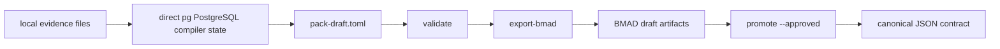
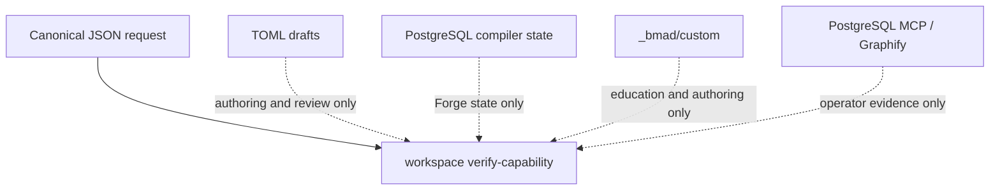

# Forge Verifier Isolation And TOML/PostgreSQL Integration Plan

## Scope

This plan captures the BMAD integration path for Capability Pack Forge v2:

- TOML is a human authoring and review draft surface.
- direct `pg` PostgreSQL is Forge compiler state.
- Forge v1 JSON remains the canonical input/output authority.
- Workspace `verify-capability` remains JSON-only declared-contract verification.
- PostgreSQL MCP remains advisory/operator evidence only.
- Graphify remains advisory planning evidence only.
- `_bmad/custom` remains an education and authoring surface only.

The implementation path is intentionally conservative: keep the public
Workspace verifier boundary narrow, then add or preserve Forge v2 compiler
behavior behind explicit Forge commands.

## User-Facing Capability

This integration lets a BMAD operator collect local evidence into Forge v2
compiler state, review a deterministic TOML draft, validate it, export BMAD
handoff artifacts, and promote only an approved result into canonical
capability-pack artifacts.

The user-visible value is a safer authoring loop:

- start from local evidence instead of ad hoc pack notes;
- review `pack-draft.toml` as a human contract draft;
- use PostgreSQL state to track provenance, stale evidence, validation reports,
  and promotion records;
- keep Workspace verification deterministic by passing only canonical JSON to
  `verify-capability`.

## Public Behavior Contract

Inputs:

- v1 Forge accepts local `forge-request.json` through `--input`.
- v2 Forge compiler commands accept `.capability-forge/forge.toml`.
- Workspace verification accepts only self-contained Capability Request JSON.

Outputs:

- v1 Forge writes draft pack artifacts to the requested output directory.
- v2 `draft` writes `pack-draft.toml`.
- v2 `validate` writes validation evidence.
- v2 `export-bmad` writes BMAD handoff artifacts after validation. Review
  packet advisory sections are optional and are not emitted by default.
- v2 `promote --approved` writes the approved target atomically.
- Workspace `verify-capability` writes no files and emits a JSON verdict.

Success is observable through deterministic artifacts, JSON verdicts, migration
records, validation reports, and explicit promotion records. Failure is
observable through stable error codes and no partial authoritative output.
Acceptance criteria map to `testTomlPostgresqlBmadIntegrationPlanArtifact`.

## Architecture Authority Boundaries

v1 JSON is the only canonical persisted capability-pack contract.

TOML is draft/import/export authoring syntax only. It is useful for review and
operator edits, but it is not verifier input and is not the canonical source of
truth.

direct `pg` PostgreSQL is internal state only. It stores compiler evidence,
provenance, migrations, review events, generated artifacts, validation reports,
and promotion records. It is not a public authority surface for Workspace.

PostgreSQL MCP remains advisory/operator evidence only. Graphify remains
advisory planning evidence only. `_bmad/custom` remains authoring education and
exposed skill override state only.

Workspace `verify-capability` remains JSON-only declared-contract verification.
It does not validate TOML, query PostgreSQL, inspect MCP state, inspect Graphify
state, read `_bmad/custom`, or infer runtime availability.

## Round-Trip And Versioning

The round trip is:

`TOML -> JSON canonicalization -> Workspace verifier`

The TOML draft can be edited for review, then Forge validates it against
database-backed compiler state before exporting canonical JSON-shaped BMAD
artifacts. Workspace reports failures against canonical JSON semantics, not
against live database state.

JSON schema changes lead; TOML follows. New capability-pack contract fields
land first in the canonical JSON schema, then the TOML draft renderer/parser is
expanded to expose those fields for review.

Backward compatibility rule: existing v1 `--input/--output` JSON behavior stays
deterministic and ignores adjacent Forge v2 state.

## TOML Field Assumptions

`pack-draft.toml` fields are limited to reviewable pack metadata, evidence refs,
declared capabilities, readiness notes, customization handoff notes, validation
status, and promotion metadata needed to reconstruct canonical BMAD artifacts.

Unsupported fields fail closed during validation. Invalid TOML fails before
export or promotion side effects. Generated TOML must be byte-stable for
equivalent compiler state.

## Exported Review Packet Notes

`tools/capability-forge/toml.js` owns review packet rendering for BMAD handoff
packets. The optional advisory section mechanism is backward-compatible:
callers that pass no advisory sections get the previous packet shape. Story 1.1
keeps `export-bmad` default packets narrow and does not add broad
TOML/PostgreSQL integration notes to every handoff packet.

When advisory sections are supplied by a future scoped story, they remain human
guidance only:

- TOML is review/authoring only, not verifier truth.
- PostgreSQL MCP is advisory evidence only, not Forge infrastructure.
- `CAPABILITY_FORGE_DATABASE_URL` gates optional live compiler work only.
- BMAD export/promotion remains explicit human review and approval.

## PostgreSQL Assumptions

Forge owns its compiler schema, migration table, evidence tables, artifact
tables, validation tables, and promotion records.

`CAPABILITY_FORGE_DATABASE_URL` gates live compiler commands and optional live
tests. CAPABILITY_FORGE_DATABASE_URL unset means live PostgreSQL migration evidence is skipped.

Database state is an implementation detail for Forge v2. Workspace verifier
behavior must remain unchanged whether the database is present, absent,
populated, stale, or misconfigured.

## Supabase/Postgres Operational Guardrails

Forge v2 direct `pg` code follows boring PostgreSQL practices when a live
compiler store is used. These guardrails are advisory for operators and design
expectations for Forge code; they are not live database requirements for
deterministic tests.

- Use connection pooling and connection limits for live compiler stores.
- Keep transactions short; do not hold locks across external work.
- Use advisory locks for promotion-like coordination.
- Index lookup, WHERE, and JOIN columns; use composite indexes for common
  multi-column lookups.
- Use partial indexes for common lifecycle-state filters.
- Configure idle timeouts for live PostgreSQL sessions.

## Integration Boundaries

Affected surfaces:

- Capability Pack Forge docs, CLI help, v1 JSON path, v2 compiler commands, and
  v2 tests.
- Workspace verifier tests and docs that preserve the JSON-only contract.
- BMad Help, Customize, and Workspace routing language.
- Optional Graphify planning references for future code/docs maps.

Unaffected surfaces:

- Workspace command set.
- Workspace verifier schema expansion.
- live MCP installation or configuration.
- `_bmad/custom` central config.
- unrelated capability profiles and examples.

## Party Mode Verdict

Participants: John, Winston, Amelia, Paige.

Decision: accept with expansion.

Required changes:

- Preserve the verifier fence between Workspace JSON contracts and Forge v2
  compiler state.
- Record a full BMAD planning artifact for TOML/PostgreSQL Forge integration.
- Lock the plan with public behavior tests before production changes.
- Treat Graphify, PostgreSQL MCP, and `_bmad/custom` as advisory/authoring
  context only.

Deferred decisions:

- Live PostgreSQL migration evidence remains optional and gated by
  `CAPABILITY_FORGE_DATABASE_URL`.
- Any future official MCP addition needs a separate approved planning prompt.

## Authority Model

| Surface | Role | Authority |
| --- | --- | --- |
| Forge v1 JSON | canonical pack/request contract | binding Forge and Workspace input |
| `.capability-forge/forge.toml` | Forge compiler config | Forge-only configuration |
| `pack-draft.toml` | byte-stable human review contract | always non-binding review-only input to DB-backed validation |
| direct `pg` PostgreSQL | compiler state for evidence, provenance, drafts, validation, export, promotion, and migrations | internal Forge state |
| PostgreSQL MCP | optional operator evidence source | advisory context only |
| Graphify | optional planning and code/docs map | advisory context only |
| `_bmad/custom` | local authoring reminders and exposed skill overrides | education and authoring only |
| `bmad workspace verify-capability` | declared contract verifier | JSON-only Workspace verdict |
| promotion output | approved Forge v2 artifact bridge | authoritative only after successful approved promotion |

## State Machine

`migrate -> ingest -> search -> draft -> validate -> export-bmad -> promote`

- `migrate`: apply checked migrations and record checksums.
- `ingest`: scan configured local evidence roots, mark prior evidence stale,
  then refresh current file spans.
- `search`: read compiler evidence state for operator review; search results
  are not truth.
- `draft`: render deterministic `pack-draft.toml` from non-stale evidence.
- `validate`: parse `pack-draft.toml` and verify it matches database-backed
  compiler state before report write.
- `export-bmad`: validate first, then emit BMAD handoff artifacts only.
- `promote`: require `--approved`, stage artifacts outside every configured
  runtime root, acquire the promotion reservation, publish with atomic
  no-replace behavior, then finalize or report a recovery code.

## Diagrams





## TDD Gates

Every story follows this sequence:

1. Add or preserve a public behavior test first.
2. Confirm red only where behavior is missing.
3. Make the smallest production change that turns the test green.
4. Refactor only after green.
5. Make no production change when current tests already prove the contract.

## Red-Green Evidence

The implementation test path is:

1. Tighten public behavior tests for the missing contract.
2. Confirm red against the incomplete behavior or plan artifact.
3. Make the smallest production or documentation change that satisfies the
   failing contract.
4. Rerun targeted Forge v2 tests and the Workspace/Forge validation suite.

Observed red evidence:

- `testTomlPostgresqlBmadIntegrationPlanArtifact` first failed while the plan
  artifact lacked the required `Red-Green Evidence` section.
- `testExportedReviewPacketsDoNotIncludeIntegrationNotesByDefault` preserves
  the Story 1.1 boundary that exported BMAD review packets do not receive broad
  TOML/PostgreSQL notes by default.

## Negative Influence Assertions

The public test must reject accidental authority creep and unrelated capability
leakage. The plan must not import unrelated BMAD agents, personas, roles, or
workflow assumptions as Forge requirements. It must not make a live MCP, local
database, Graphify artifact, Calendar example, Docker example, Context7 example,
or Codex config necessary for Workspace verification.

The plan must keep advisory evidence optional. Graphify advisory language is optional, never mandatory.
PostgreSQL MCP remains outside runtime compiler infrastructure. Any future MCP
addition needs its own planning decision.

Targeted validation:

```bash
node test/test-workspace-cli.js
node test/test-workspace-contracts.js
node test/test-capability-pack-forge.js
node test/test-capability-forge-v2.js
npm run validate:skills
npm run validate:refs
npm run validate:graphify-manifests
```

Before push:

```bash
npm ci && npm run quality
```

## Epics And Stories

### Epic 1: Contract Fence

Story 1.1: lock verifier JSON-only behavior.

Acceptance criteria:

- `verify-capability --input` reads only the explicit JSON file.
- Ambient TOML, PostgreSQL, MCP, Graphify, `_bmad/custom`, Codex config, and
  Workspace session artifacts do not change the verdict.
- Clean and poisoned workspaces produce identical normalized verifier verdicts.

Story 1.2: reject non-JSON and malformed input.

Acceptance criteria:

- TOML draft input exits `1`.
- stdout is JSON with `ok: false` and `REQUEST_INVALID`.
- observations are empty.
- stderr is empty.
- no filesystem writes occur.

Story 1.3: preserve v1 JSON canonical behavior.

Acceptance criteria:

- v1 `--input/--output` outputs deterministic artifacts.
- Adjacent `.capability-forge`, `pack-draft.toml`, Graphify files, and
  PostgreSQL env vars are ignored by the v1 path.

### Epic 2: TOML Draft Contract

Story 2.1: keep `pack-draft.toml` byte-stable.

Acceptance criteria:

- rendering is deterministic for equivalent compiler state.
- generated TOML parses before write.
- malformed TOML blocks validate/export/promote before side effects.

Story 2.2: document TOML as review-only.

Acceptance criteria:

- CLI help, Forge docs, and skill docs describe TOML as authoring/review only.
- No doc or generated artifact implies TOML can satisfy Workspace verification.

### Epic 3: PostgreSQL Compiler State

Story 3.1: use direct `pg` only.

Acceptance criteria:

- Forge runtime code does not depend on PostgreSQL MCP package names or
  interfaces.
- `CAPABILITY_FORGE_DATABASE_URL` gates live compiler commands and optional live
  tests.

Story 3.2: enforce migration checksums.

Acceptance criteria:

- migrations record SHA-256 checksums.
- checksum drift fails closed.
- forward repair migrations remain the recovery path.

Story 3.3: preserve optional live validation.

Acceptance criteria:

- live PostgreSQL migration test skips unless
  `CAPABILITY_FORGE_DATABASE_URL` is set.
- deterministic CI does not require a live database.

### Epic 4: Compiler Commands

Story 4.1: commands are explicit transitions.

Acceptance criteria:

- `ingest`, `search`, `draft`, `validate`, `export-bmad`, and `promote` each
  have explicit inputs and outputs.
- search results are operator context only.
- export emits BMAD handoff artifacts only.

Story 4.2: stale evidence blocks authority-changing steps.

Acceptance criteria:

- referenced stale evidence fails with `FORGE_DRAFT_STALE_EVIDENCE`.
- validate/export/promote stop before side effects.

Story 4.3: promotion is atomic.

Acceptance criteria:

- promotion requires `--approved`.
- unsafe targets, symlinks, path traversal, and dirty targets fail closed unless
  a tested override is explicitly used.
- copy failures remove temp dirs and leave no authoritative target.
- concurrent promotion reports `FORGE_PROMOTE_CONFLICT`.
- prepared-row mismatch reports `FORGE_PROMOTE_RECONCILE_REQUIRED`.

### Epic 5: BMAD Integration

Story 5.1: Help routing.

Acceptance criteria:

- `bmad-help` can route users to CPF, Workspace, Customize, capability refactor
  prompt, official MCP addition prompt, Create Epics and Stories,
  Implementation Readiness, and Sprint Planning.
- Help text does not imply Workspace verifier dependency on Forge v2 state.

Story 5.2: Customize boundary.

Acceptance criteria:

- `bmad-customize` may add exposed per-skill authoring reminders only.
- `_bmad/custom` never grants verifier truth, runtime authority, grant bypass,
  or Forge promotion authority.

Story 5.3: Workspace evidence.

Acceptance criteria:

- Workspace records results, reviews, closeouts, archives, and evidence.
- Workspace does not execute Forge, Graphify, MCP, PostgreSQL, or generated
  Codex task packets.

### Epic 6: Graphify Advisory Map

Story 6.1: optional code/docs graph.

Acceptance criteria:

- Graphify may map `tools/capability-forge`, `tools/workspace`, and
  `docs/workspace/templates`.
- Graphify output is planning evidence only.
- Graphify output cannot change verifier pass/fail, Forge validation,
  export, or promotion.

### Epic 7: Refactor/MCP Decisions

Story 7.1: Capability Refactor Decision.

Acceptance criteria:

- Refactor planning is approved only as a planning prompt.
- Implementation still requires public red/green behavior tests.
- No broad refactor lands inside a narrow boundary slice.

Story 7.2: Official MCP Addition Decision.

Acceptance criteria:

- No official MCP is added for Workspace verifier or Forge infrastructure.
- Existing local docs, scripts, tests, and direct `pg` code remain higher
  leverage for this slice.
- Any future official MCP addition must be scoped to advisory/operator
  evidence and receive separate approval.

## Artifact Authority Table

| Artifact | Owner command | Mutable | Verifier input | Promotion path |
| --- | --- | --- | --- | --- |
| `forge-request.json` | v1 Forge `--input` | operator-authored | indirectly, via generated JSON request | not promoted by v2 |
| `capability-request.json` | v1 Forge or `export-bmad` | generated | yes | canonical contract artifact |
| `.capability-forge/forge.toml` | operator | yes | no | none |
| `pack-draft.toml` | `draft` | review-edited | no | validate then export |
| PostgreSQL compiler rows | Forge v2 commands | transactional | no | export then promote |
| `customization-draft.toml` | Forge v1 output | draft only | no | route through `bmad-customize` |
| Graphify graph files | operator/Graphify | advisory | no | none |

## Command Contract Table

| Command | Input | Output | Validates | Writes DB | Writes filesystem |
| --- | --- | --- | --- | --- | --- |
| v1 `--input/--output` | local JSON request | draft pack artifacts | request schema and local evidence refs | no | output dir only |
| `migrate` | `forge.toml` | migration records | migration checksum | yes | no |
| `ingest` | `forge.toml`, local evidence roots | evidence rows/spans | path and evidence filters | yes | no |
| `search` | query | matches | compiler state only | no | no |
| `draft` | compiler state | `pack-draft.toml` | non-stale evidence | yes | draft dir |
| `validate` | `pack-draft.toml`, compiler state | validation report | TOML, schema, stale refs | yes | report |
| `export-bmad` | validated draft | BMAD handoff artifacts | validation first | yes | draft dir |
| `promote` | approved draft, safe target | promoted artifacts | approval, safe target, stale refs | yes | target dir atomically |

## Failure Mode Table

| Failure | Code | Required behavior |
| --- | --- | --- |
| missing config | `FORGE_CONFIG_MISSING` | fail before database work |
| invalid TOML | `FORGE_TOML_INVALID` | fail before validate/export/promote side effects |
| stale referenced evidence | `FORGE_DRAFT_STALE_EVIDENCE` | require `ingest` and regenerated draft |
| unapproved promotion | `FORGE_PROMOTE_REQUIRES_APPROVED` | no target mutation |
| concurrent promotion | `FORGE_PROMOTE_CONFLICT` | no target mutation |
| prepared state mismatch | `FORGE_PROMOTE_RECONCILE_REQUIRED` | require operator inspection |
| copy or rename failure | `FORGE_PROMOTE_COPY_FAILED` | remove temp dir and leave no target |
| Workspace non-JSON input | `REQUEST_INVALID` | JSON stdout, empty observations, no writes |

## Help Route Table

| Need | BMAD route |
| --- | --- |
| Generate capability pack drafts | `bmad-capability-pack-forge` |
| Verify declared capability JSON | `bmad-workspace` with `verify-capability` |
| Author local reminders or skill overrides | `bmad-customize` |
| Plan safe capability refactor | `bmad-capability-refactor-plan-prompt` |
| Decide whether to add official MCP | `bmad-highest-leverage-official-mcp-addition-prompt` |
| Decompose implementation | `bmad-create-epics-and-stories` |
| Check implementation readiness | `bmad-check-implementation-readiness` |
| Sequence delivery | `bmad-sprint-planning` |

## Docs Help Customize Routing

Route discovery starts at `docs/workspace/index.md`.

Operator route:

1. Use `bmad-help` to choose the right BMAD surface.
2. Use `bmad-capability-pack-forge` to generate or operate Forge artifacts.
3. Use `bmad-workspace verify-capability` only for canonical JSON declared
   capability checks.
4. Use `bmad-customize` only for exposed authoring reminders or skill
   overrides.
5. Use `bmad-capability-refactor-plan-prompt` only when a concrete repeated
   implementation pattern needs refactor planning.
6. Use `bmad-highest-leverage-official-mcp-addition-prompt` only for a separate
   official MCP decision.

Operator failure lookup:

- TOML parse or DB-backed match failure: inspect `pack-draft.toml` and the
  Forge validation report.
- PostgreSQL migration or state failure: inspect Forge migration records and
  `CAPABILITY_FORGE_DATABASE_URL` state without recording secrets.
- Workspace verification failure: inspect the canonical Capability Request JSON
  and declared Workspace Capability Contract fields.
- BMAD pack wiring failure: inspect exported BMAD handoff artifacts before
  promotion.

## Graphify Advisory Map

Recommended Graphify scope for future planning:

- `tools/capability-forge`
- `tools/workspace`
- `docs/workspace/templates`

Expected use:

- visualize Forge/Workspace boundary terms;
- inspect code/docs clusters before refactor planning;
- record advisory graph evidence through Workspace result or closeout when
  useful.

Forbidden use:

- verifier input;
- Forge validation truth;
- promotion approval;
- hidden execution, watcher, daemon, or live adapter.

## Capability Refactor Decision

Decision: approve planning only.

Rationale:

- Boundary risk is authority leakage, not code duplication.
- Public behavior tests already protect the first fence.
- Refactor should follow evidence-backed red/green behavior gaps, not precede
  them.

Next action:

- Run refactor planning only when a concrete behavior gap or repeated local
  complexity appears.

## Official MCP Addition Decision

Decision: reject/defer for verifier and Forge infrastructure.

Rationale:

- Forge compiler infrastructure already has direct `pg` code.
- Workspace verifier must remain self-contained and deterministic.
- PostgreSQL MCP, Graphify MCP, and other live tools are useful as operator
  context, but not as infrastructure for this boundary.

Next action:

- Revisit only for recurring advisory evidence workflows with official source
  proof, clear owner, security boundary, and fallback.

## Release Readiness Checklist

- `node test/test-capability-forge-v2.js`
- `node test/test-capability-pack-forge.js`
- `node test/test-workspace-cli.js`
- `node test/test-workspace-contracts.js`
- `npm run validate:skills`
- `npm run validate:refs`
- `npm run validate:graphify-manifests`
- `npm ci && npm run quality` on exact `HEAD` before push

Warnings or LOW findings must be marked accepted, fixed, deferred, or
false-positive with a reason before push readiness is claimed.

Story 1.1 final evidence is preserved under
`_bmad-output/implementation-artifacts/evidence/story-1-1-20260510/`. The
final quality log is
`_bmad-output/implementation-artifacts/evidence/story-1-1-20260510/npm-ci-quality.log`
and must end with `__QUALITY_EXIT_STATUS__=0` before done readiness is claimed.

## Dirty Worktree Scope

Story 1.1 implementation evidence is tracked in
`_bmad-output/implementation-artifacts/1-1-reject-toml-as-workspace-verifier-input.md`.
The scoped implementation surface includes, at minimum:

- `docs/workspace/capability-forge-toml-postgresql-bmad-integration-plan.md`
- `docs/workspace/index.md`
- `test/test-capability-forge-v2.js`
- `test/test-workspace-cli.js`
- `tools/workspace/capability-verifier.js`
- `tools/capability-forge/*`
- `docs/workspace/capability-pack-forge.md`
- `src/core-skills/bmad-capability-pack-forge/SKILL.md`
- `_bmad-output/implementation-artifacts/evidence/story-1-1-20260510/*`

No unrelated dirty file may be staged, formatted, reset, cleaned, or committed.
If a shared dirty file contains unrelated user edits, stage only the relevant
hunks or ask before including the whole file.

## Non-Goals

- No TOML as v1 input.
- No PostgreSQL requirement for Workspace verifier.
- No PostgreSQL MCP as Forge infrastructure.
- No Graphify, MCP, `_bmad/custom`, Codex config, or Workspace Session artifact
  as verifier authority.
- No unrelated dirty worktree cleanup.
- No production change when current tests already prove behavior.
