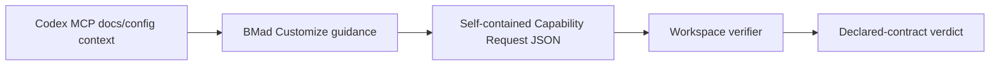
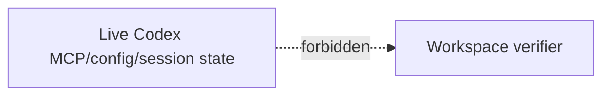

# BMad Customize And Codex MCP Planning

## Decision Summary

Codex MCP support is advisory authoring context only. BMad Customize may teach,
scaffold, and document Codex MCP-aware capability authoring, but Workspace
verification remains sealed verifier evidence over self-contained Capability
Request JSON.

This keeps `bmad-customize` useful when users say "use Codex MCP" while keeping
`bmad workspace verify-capability` deterministic, offline-friendly, and
reproducible on the exact `HEAD` being checked.

## Source Of Truth

Source authority: `src/core-skills/bmad-customize/SKILL.md`.

`.agents/` is a gitignored install artifact, not committed authority. If local
installed skill parity matters, refresh the install from source after the source,
docs, and tests are updated.

## Glossary

| Term | Meaning |
| --- | --- |
| `bmad-customize` | Authoring and education surface for per-skill agent or workflow overrides. |
| Advisory authoring context | Codex MCP, docs, profile registry, and local observations that may help a user author guidance or examples. |
| Sealed verifier evidence | The self-contained Capability Request JSON passed to Workspace verification. |
| Workspace verifier | Deterministic checker behind `bmad workspace verify-capability`; consumes self-contained JSON only. |
| Capability Request JSON | Request document containing the requested capability, embedded declarations, and optional advisory observations. |
| Declared capability | Capability contract object embedded in a Capability Request JSON fixture. |
| Executable proof | Command-backed transcript, probe, or test result that demonstrates behavior outside the verifier. |
| Human decision | Reviewer/operator judgment recorded through Workspace result, review, closeout, or archive evidence. |
| Codex MCP host | Codex CLI/app capability to configure and manage MCP servers through `mcp_servers.*` and `codex mcp`. |
| Codex MCP server | One configured MCP server, such as OpenAI Docs MCP, that can supply context to an operator. |
| OpenAI Docs MCP | Official documentation source for Codex/OpenAI developer product facts. |
| `_bmad/custom` | Customization output/config area; never verifier input. |

## Boundary Model

Allowed path:



Forbidden path:



Allowed Customize outputs:

- Documentation explaining Codex MCP-aware authoring.
- Capability Request examples that remain self-contained JSON.
- Prompts and warnings that explain what MCP can inform and what it cannot prove.
- Evidence checklists for declared contract, executable proof, and human decision.
- Per-skill reminders through exposed `customize.toml` fields.

Forbidden Workspace couplings:

- No verifier hydration from `_bmad/custom`, hand-authored TOML, or resolver output.
- No verifier reads from `~/.codex/config.toml` or project `.codex/config.toml`.
- No verifier calls to app-server APIs, live MCP servers, live Graphify, or
  Workspace Session artifacts.
- No network deps in verifier behavior.
- No new capability id, schema, API, or verifier behavior without a separate
  architecture decision.
- No claim that `executor.codex.manual` proves live MCP behavior.

## Evidence Model

| Layer | Authority | Output |
| --- | --- | --- |
| Declared contract | `bmad workspace verify-capability` | Verdict over a self-contained Capability Request JSON fixture. |
| Advisory authoring context | OpenAI Docs MCP, Codex config docs, capability profile registry, local observations | User-facing guidance, examples, warnings, and evidence checklists. |
| Executable proof | Codex CLI, Codex Desktop, or `codex mcp-server` transcript | Command-backed evidence with version, cwd, timestamp, exit code, and result summary. |
| Human decision | Workspace result/review/closeout/archive | Reviewer judgment, evidence refs, unresolved gaps, and next action. |

`mcp_servers.*`, `codex mcp`, and Codex config output can explain operator
context. They are not declared capability compatibility. OpenAI Docs MCP can
ground documentation facts about Codex MCP behavior. It is not runtime proof.

## Examples

Valid:

- `docs/workspace/templates/capability-request.codex-manual.example.json`
  declares `executor.codex.manual` in self-contained JSON.
- `bmad workspace verify-capability --input docs/workspace/templates/capability-request.codex-manual.example.json`
  returns a declared-contract verdict for that JSON.

Invalid:

- `verify-capability` reads `_bmad/custom`.
- `verify-capability` reads `~/.codex/config.toml` or project
  `.codex/config.toml`.
- `verify-capability` depends on live MCP, app-server APIs, live Graphify, or
  Workspace Session artifacts.
- Embedded `executableEvidence` claims promote verifier compatibility.

## Implementation Plan

1. Update `src/core-skills/bmad-customize/SKILL.md` to use the terms advisory
   authoring context and sealed verifier evidence.
2. Keep `docs/workspace/templates/capability-request.codex-manual.example.json`
   as the canonical Codex manual capability request fixture.
3. Keep the verifier interface unchanged: no new capability id, no new schema
   field, no runtime probe.
4. Update Workspace docs to point customization discussions here.
5. Add or preserve tests that reject executable evidence in Capability Request
   declarations and unknown top-level request fields.
6. Add or preserve source scans proving verifier code does not depend on
   `_bmad/custom`, `~/.codex`, `.codex/config`, `node:http`, `node:https`, or
   `commandEvidence`.
7. Run targeted Workspace tests, `npm run validate:skills`, and final
   `npm ci && npm run quality` on exact `HEAD` before push.

## Acceptance Criteria

- `AC1`: Customize documents Codex MCP as advisory authoring context only.
- `AC2`: Customize forbids treating Codex MCP output as verifier input.
- `AC3`: Workspace capability verifier accepts only self-contained Capability
  Request JSON.
- `AC4`: Docs name forbidden verifier sources: `_bmad/custom`, `~/.codex`,
  `.codex/config`, app-server APIs, live MCP, live Graphify, Workspace Session
  artifacts, and network deps.
- `AC5`: Negative tests reject `executableEvidence` and unknown top-level fields.
- `AC6`: Source scans assert verifier code avoids forbidden deps/strings:
  `_bmad/custom`, `~/.codex`, `.codex/config`, `node:http`, `node:https`, and
  `commandEvidence`.
- `AC7`: `.agents/` drift is handled as install artifact drift, not committed
  source.
- `AC8`: `npm ci && npm run quality` passes on exact `HEAD` before push.

## Red-Test Matrix

| Future behavior | Test assertion |
| --- | --- |
| Customize guidance for Codex targets is MCP-aware | Output mentions `advisory authoring context`, `mcp_servers.*`, `codex mcp`, and declared JSON verification. |
| Customize preserves verifier isolation | Output never tells `verify-capability` to read Codex config, `_bmad/custom`, app-server state, live MCP, live Graphify, or Workspace artifacts. |
| `executor.codex.manual` remains default | Existing Codex manual fixture passes unchanged and does not require a new capability field. |
| Verifier stays self-contained | Local config/customization changes do not affect the verdict for the same input JSON. |
| Docs keep the boundary visible | Customize docs say authoring and education only; Workspace docs say verifier isolation remains a hard boundary. |

## Non-Mutating Probes

Use these as planning or evidence-prep probes before implementation:

```bash
bmad --version
bmad workspace --help
codex --version
codex mcp --help
codex mcp list --json
codex mcp-server --help
bmad workspace verify-capability --input docs/workspace/templates/capability-request.codex-manual.example.json
```

## Canonical References

- `src/core-skills/bmad-customize/SKILL.md`
- [Workspace Capability Contract](./capability-contract.md)
- [Codex Executable Capability Evidence Plan](./codex-executable-capability-evidence-plan.md)
- [Capability Request Template](./templates/capability-request.template.json)
- [Codex Manual Capability Request Example](./templates/capability-request.codex-manual.example.json)
- [Codex Executable Evidence Template](./templates/codex-executable-evidence.template.json)
- [OpenAI Codex Config Reference](https://developers.openai.com/codex/config-reference#configtoml)
- [OpenAI Codex CLI MCP Reference](https://developers.openai.com/codex/cli/reference#codex-mcp)
