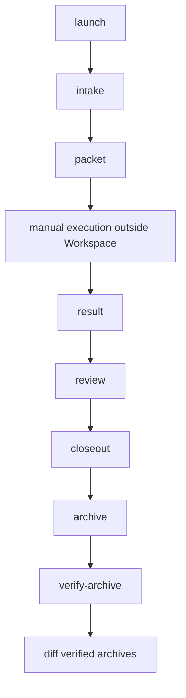

# BMAD Workspace Operator Quickstart

Active branch for this hardening line is `codex/bmad-workspace`. The requested
`codex/workspace` branch is absent in the reviewed checkout; use the actual
branch name when comparing or preparing review.

Workspace is manual evidence only. It does not execute stored commands, schedule
work, restore archives, replay results, merge branches, promote changes, or call
live adapters.

## First-Hour Flow

| I need to | Command | Artifact to inspect next |
| --- | --- | --- |
| Start a disposable session | `launch` | `instance.json`, `repo-pack.json`, `grants.json` |
| Record repo provenance | `intake` | `intake/repo-intake.json` |
| Create execution packet | `packet` | `packets/bmad-work-packet.json`, `packets/executor-contract.json` |
| Inspect state | `status` or `evidence` | checks, next manual actions |
| Continue in Codex | `handoff` | Markdown continuation context |
| Record manual work | `result` | `results/<result-id>.json` |
| Review worktrees | `review` | `review/summary.json`, `review/review-manifest.json` |
| Record final decision | `closeout` | `closeout/<closeout-id>.json` |
| Preserve evidence | `archive` then `verify-archive` | `manifest.json`, `checksums.sha256` |
| Compare evidence bundles | `diff` | archive-only JSON deltas |

## Runnable

This command is safe to run in a prepared checkout and prints the command
registry, command classes, and options.

```bash
bmad workspace --help
```

## PSEUDO

Replace every placeholder before running. This sequence shows the expected
manual ceremony.

```bash
# PSEUDO
bmad workspace launch --repo <target-repo> --goal <goal-file> --runtime-root <root>
bmad workspace intake <session-id> --runtime-root <root>
bmad workspace packet <session-id> --runtime-root <root> --workflow <skill[:action]> \
  --zoom-out-ref <ref> --ubiquitous-language-ref <ref> \
  --grill-decisions-ref <ref> --tdd-plan-ref <ref>
bmad workspace evidence <session-id> --runtime-root <root>
bmad workspace handoff <session-id> --runtime-root <root>
bmad workspace result <session-id> --runtime-root <root> --input <result-json> --result-id <id>
bmad workspace review <session-id> --runtime-root <root>
bmad workspace closeout <session-id> --runtime-root <root> --input <closeout-json> --closeout-id <id>
bmad workspace archive <session-id> --runtime-root <root> --output <archive-dir>
bmad workspace verify-archive <archive-dir>
```

## Sample Output

This is illustrative output only; timestamps, paths, and ids vary.

```json
{
  "sessionId": "session-20260504120000-ab12cd",
  "archiveVersion": 2,
  "ok": true
}
```

## Lifecycle



## Safety Notes

- `destroy` is destructive for disposable runtime state. Keep review artifacts
  with `--keep-review` when evidence must remain available.
- `authorize` validates grants before target mutation and records violation
  evidence only on denial.
- `archive` creates a new evidence bundle. It is not a restore package.
- `verify-archive` checks integrity only. It does not repair or import data.
